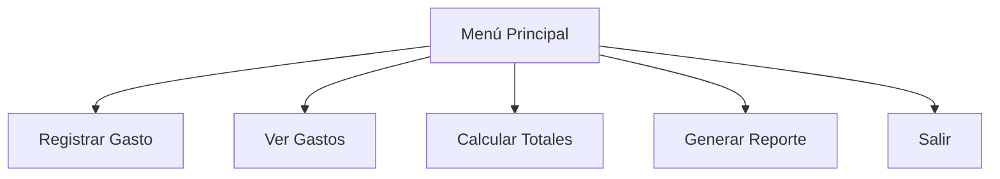

<div align="center">

# Simulador de Gastos Diarios  
**Controla tus finanzas con Python**


---

**JOHAN MONSALVE**  


</div>

---

## Descripción del Proyecto

**Simulador de Gastos Diarios** es una **herramienta en consola** desarrollada en **Python** que permite:

- Registrar gastos diarios con categoría, monto y fecha  
- Filtrar por **período de tiempo** (día, semana, mes)  
- Calcular totales automáticos  
- Generar **reportes detallados** y **guardarlos en archivos**  
- Visualizar datos en **tablas claras** con `tabulate`  

> **Datos persistentes en `gastos.json`** – ¡Nunca pierdas tu historial!

---

## Funcionalidades

| Función | Descripción |
|--------|-----------|
| **Registrar gasto** | Ingresa monto, categoría y fecha |
| **Ver gastos** | Filtra por día, semana o mes |
| **Calcular totales** | Suma por período o categoría |
| **Generar reporte** | Exporta en `.txt` con formato limpio |
| **Menú interactivo** | Navegación fácil en consola |



# 🛠️ Tecnologías Usadas

| Tecnología     | Uso                              |
|----------------|----------------------------------|
| **Python 3**         | Lógica principal y estructura          |
| **JSON**      | Almacenamiento persistente de datos          |
| **Tabulate**     | Tablas visuales en consola         |
| **Datetime**     | Manejo de fechas y períodos        |

## ⚙️ Instalación y Uso

Sigue estos pasos para ejecutar el proyecto localmente🧑‍💻👇:

```bash
# 1. Instalar dependencia
pip install tabulate

# 2. Clonar el repositorio
git clone https://github.com/Johanbadillo/Python_Proyecto.git

# 3. Entrar al directorio
cd Python_Proyecto

# 4. Ejecutar el programa
python proyecto.py
```

## 📁 Estructura del proyecto
```
📁 Python_Proyecto/
├── 📁 Data/
│   ├── data.json
│   └── dataReportes.json
├── 📁 Funciones/
│   ├── funciones.py
│   ├── funcionesJson.py
│   └── funcionesMensajes.py
├── proyecto.py
├── LICENSE
└── README.md
```

## Video Explicativo
<div align="center">
 
[Video de Demostración](https://www.youtube.com/watch?v=cRWHBtwMylU)

</div>
